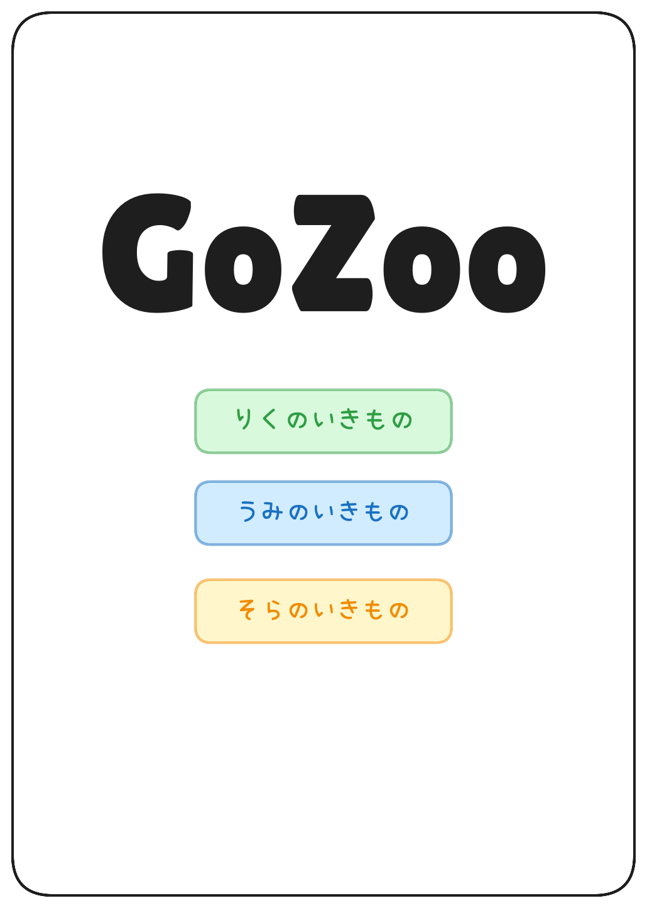
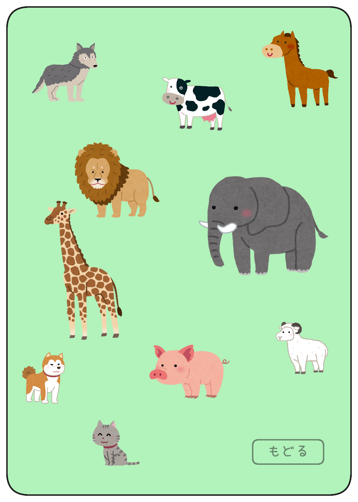

# 詳細設計

## 1. 概要
以下について記載します。
- 画面設計
- イベント仕様
- 画面遷移図
- リソース管理
- 資材ファイルの命名規則

----

## 2. 画面設計

### 2.1 ホーム画面
- 概要: アプリ起動後に表示されるメインメニュー
- レイアウト図: 
- 主な構成要素
    - タイトルロゴ
    - りくのいきもの ボタン
    - うみのいきもの ボタン
    - そらのいきもの ボタン

### 2.2 陸の生き物画面
- 概要: 陸に住む動物を表示する画面。動物をタップすることで鳴き声を再生する。
- レイアウト図: 
- 主な画面要素
    - 動物アイコン（例: 犬、ライオン、象）
    - もどる ボタン

### 2.3 海の生き物画面（TODO: レイアウト画像を追加する）
- 概要: 海に住む動物を表示する画面。動物をタップすることで鳴き声を再生する。
- レイアウト図: 
- 主な画面要素
    - 動物アイコン（例: イルカ、クジラ、アシカ）
    - もどる ボタン

### 2.4 空の生き物画面（TODO: レイアウト画像を追加する）
- 概要: 海に住む動物を表示する画面。動物をタップすることで鳴き声を再生する。
- レイアウト図: 
- 主な画面要素
    - 動物アイコン（例: タカ、ニワトリ、スズメ）
    - もどる ボタン

----

## 3. イベント設計
│ 画面         │ 要素        │ イベント │ アクション
│-------------│-------------│--------│----------------------------------------------
│ ホーム画面    │ 生物ボタン   │ タップ   │ 各種生き物画面に遷移
│-------------│-------------│--------│----------------------------------------------
│ 各種生き物画面 │ 動物アイコン │ タップ   │ 画面中央に動物を移動(背景を若干薄暗くする)
│             │             │         │ 左右に動くアニメーションのあとに鳴き声音声を再生
│             │-------------│---------│---------------------------------------------
│             │ 戻るボタン    │ タップ   │ ホーム画面に戻る

----

## 4. 画面遷移図(TODO: 画面遷移図を追加)

----

## 5. リソース管理
- 動物アイコン: `/assets/images/陸/image_land_dog.png`等
- 音声ファイル: `/assets/sounds/陸/sound_land_dog.mp3`等

----

## 6. 資材ファイルの命名規則
- 動物アイコン: `image_land_dog.png`(image + アンダースコア + 種別 + アンダースコア + 動物名 + 拡張子)
- 音声ファイル: `sound_land_dog.mp3`(sound + アンダースコア + 種別 + アンダースコア + 動物名 + 拡張子)
- クラス名
    - View: `HomePage_View.xaml`(画面名 + アンダースコア + View + 拡張子) 
                `LandAnimalsPage_View.xaml`(画面名(種別 + Animals + Page) + アンダースコア + View + 拡張子)
    - ViewModel: `HomePage_ViewModel.cs`(画面名 + アンダースコア + ViewModel + 拡張子) 
                `LandAnimalsPage_ViewModel.cs`(画面名(種別 + Animals + Page) + アンダースコア + View + 拡張子)

----

## 7. その他メモ
